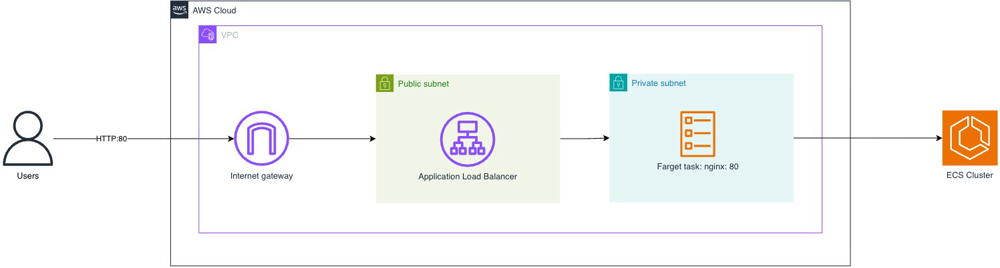

# ECS Fargate Service

An Amazon ECS service running on AWS Fargate behind an Application Load Balancer, deployed into a
dedicated VPC. The service runs the public `nginx` container image on port 80 and is reachable
through an internet-facing load balancer.

## Architecture

## Transformation input

The `cdk.out/` directory is the input to the CDK → EDMM transformation. The cdk-plugin parser only
reads:

- `manifest.json` — the list of stacks,
- `tree.json` — the CDK construct hierarchy,
- `EcsFargateStack.template.json` — the synthesized CloudFormation resources.

## Origin

Adapted from the official
[aws-samples/aws-cdk-examples](https://github.com/aws-samples/aws-cdk-examples) repository
(`typescript/ecs/fargate-application-load-balanced-service`).
