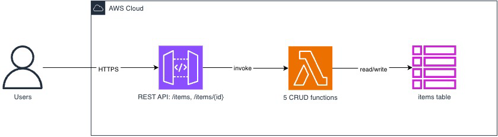

# APIGateway with CORS, Lambdas, and CRUD on DynamoDB

<!--BEGIN STABILITY BANNER-->


> **This is a stable example. It should successfully build out of the box**
>
> This examples is built on Construct Libraries marked "Stable" and does not have any infrastructure prerequisites to build.

---

<!--END STABILITY BANNER-->

This an example of an APIGateway with CORS enabled, pointing to five Lambdas executing CRUD operations on a single DynamoDB table.

## Architecture



## Build

To build this app, you need to be in this example's root folder. Then run the following:

```bash
npm install -g aws-cdk
npm install
npm run build
```

This will install the necessary CDK, then this example's dependencies, then the lambda functions' dependencies, and then build your TypeScript files and your CloudFormation template.

## Deploy

Run `cdk deploy`. This will deploy / redeploy your Stack to your AWS Account.

After the deployment you will see the API's URL, which represents the url you can then use.

## The Component Structure

The whole component contains:

- An API, with CORS enabled on all HTTP Methods. (Use with caution, for production apps you will want to enable only a certain domain origin to be able to query your API.)
- Lambda pointing to `lambdas/create.ts`, containing code for **storing** an item into the DynamoDB table.
- Lambda pointing to `lambdas/delete-one.ts`, containing code for **deleting** an item from the DynamoDB table.
- Lambda pointing to `lambdas/get-all.ts`, containing code for **getting all items** from the DynamoDB table.
- Lambda pointing to `lambdas/get-one.ts`, containing code for **getting an item** from the DynamoDB table.
- Lambda pointing to `lambdas/update-one.ts`, containing code for **updating an item** in the DynamoDB table.
- A DynamoDB table `items` that stores the data.
- Five `LambdaIntegrations` that connect these Lambdas to the API.

## CDK Toolkit

The [`cdk.json`](./cdk.json) file in the root of this repository includes
instructions for the CDK toolkit on how to execute this program.

After building your TypeScript code, you will be able to run the CDK toolkit commands as usual:

```bash
    $ cdk ls
    <list all stacks in this program>

    $ cdk synth
    <generates and outputs cloudformation template>

    $ cdk deploy
    <deploys stack to your account>

    $ cdk diff
    <shows diff against deployed stack>
```

## Why this example

It complements `01-ecs-fargate-service` on the parts that matter for the transformation:

- **`connects_to` instead of `hosted_on`.** Example 01 is dominated by containment
  (task -> subnet -> VPC). Here the interesting relations are Lambda -> DynamoDB and
  API Gateway -> Lambda.
- **The relations are implicit.** `dynamoTable.grantReadWriteData(fn)` emits no link in the
  template. It becomes an `AWS::IAM::Policy` whose resource ARN points at the table, plus a
  `TABLE_NAME` environment variable holding a `Ref`. The relation has to be _derived_ from IAM
  policies and environment references rather than read off containment.
- **No host.** Lambda and DynamoDB are fully managed, so no component can be `hosted_on` a compute
  node. This is where EDMM's hosting assumption has to be addressed explicitly.
- **Real deployment artifacts.** Each function has bundled code, which maps onto EDMM's Artifact
  concept. Example 01 only references a public container image by name.

## Transformation input

- `cdk.out/` — the synthesized CloudFormation output (`manifest.json`, `tree.json`,
  `ApiLambdaCrudDynamoDBStack.template.json`) used as the transformation input.

The template contains 44 resources: 5 `Lambda::Function`, 5 `IAM::Role`, 5 `IAM::Policy`,
5 `Logs::LogGroup`, 10 `Lambda::Permission`, 7 `ApiGateway::Method`, 2 `ApiGateway::Resource`,
1 each of `DynamoDB::Table`, `ApiGateway::RestApi`, `ApiGateway::Deployment`, `ApiGateway::Stage`,
and `CDK::Metadata`.
