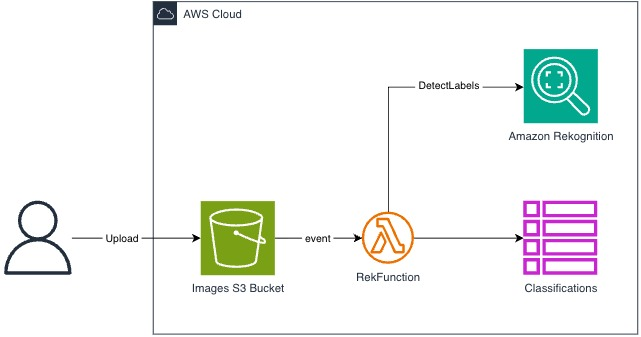

# Rekognition Lambda S3 Trigger

## <!--BEGIN STABILITY BANNER-->


> **This is a stable example. It should successfully build out of the box**
>
> This example is built on Construct Libraries marked "Stable" and does not have any infrastructure prerequisites to build.

---

<!--END STABILITY BANNER-->

This project is intended to be sample code only. Not for use in production.

This project will create the following in your AWS cloud environment:

- S3 bucket
- DynamoDB table
- Lambda function that performs image classification via AWS Rekognition when new images are uploaded to the S3 bucket
- Roles and policies allowing appropriate access to these resources

Rekognition labels will be written to CloudWatch logs, as well as the DynamoDB table.

## Architecture



This project was inspired by the AWS CDK workshop (https://cdkworkshop.com) and I highly recommend you go through that as well.

---

Requirements:

- git
- npm (node.js)
- AWS access key & secret for AWS user with permissions to create resources listed above

---

First, you will need to install the AWS CDK:

```
$ npm install -g aws-cdk
```

Install the required dependencies:

```
$ npm install
```

At this point you can build and then synthesize the CloudFormation template for this code.

```
$ npm run build
$ cdk synth
```

If you haven't already you'll need to deploy the [CDK Bootstrap stack](https://docs.aws.amazon.com/cdk/latest/guide/bootstrapping.html).
_This only needs to be ran once per account/region_

```sh
$ cdk bootstrap
```

If everything looks good, go ahead and deploy!

```sh
$ cdk deploy
```

## Testing the app

Upload an image fie to the S3 bucket that was created by CloudFormation.
The image will be automatically classified.
Results can be found in DynamoDB, and CloudWatch logs for the Lambda function.
See the stack's outputs for the S3 upload command and other resource identifiers.

To clean up, issue this command (this will NOT remove the DynamoDB
table, CloudWatch logs, or S3 bucket -- you will need to do those manually) :

```
$ cdk destroy
```

# Useful commands

- `cdk --version` Emit the CDK version
- `cdk ls` list all stacks in the app
- `cdk synth` emits the synthesized CloudFormation template
- `cdk deploy` deploy this stack to your default AWS account/region
- `cdk diff` compare deployed stack with current state
- `cdk docs` open CDK documentation

---

This code has been tested and verified to run with AWS CDK 2.8

## Why this example

- **Event-driven relation.** S3 notifies Lambda through bucket notifications, rather than the
  synchronous API Gateway -> Lambda call in example 02.
- **A dependency with no resource behind it.** Rekognition appears in the template only as the IAM
  action `rekognition:DetectLabels` on resource `*`. There is no `AWS::Rekognition::*` resource, so
  the far end of that relation has to be synthesised or it is lost.
- **Three grant styles in one stack** — `table.grantReadWriteData()`, `bucket.grantReadWrite()`, and
  a hand-written `iam.PolicyStatement`.

## Transformation input

- `cdk.out/` — the synthesized CloudFormation output (`manifest.json`, `tree.json`,
  `RekognitionLambdaS3TriggerStack.template.json`) used as the transformation input.

Only one of the three `Lambda::Function` resources is application code; the other two are CDK
scaffolding from `addEventNotification()` and `autoDeleteObjects: true`.
