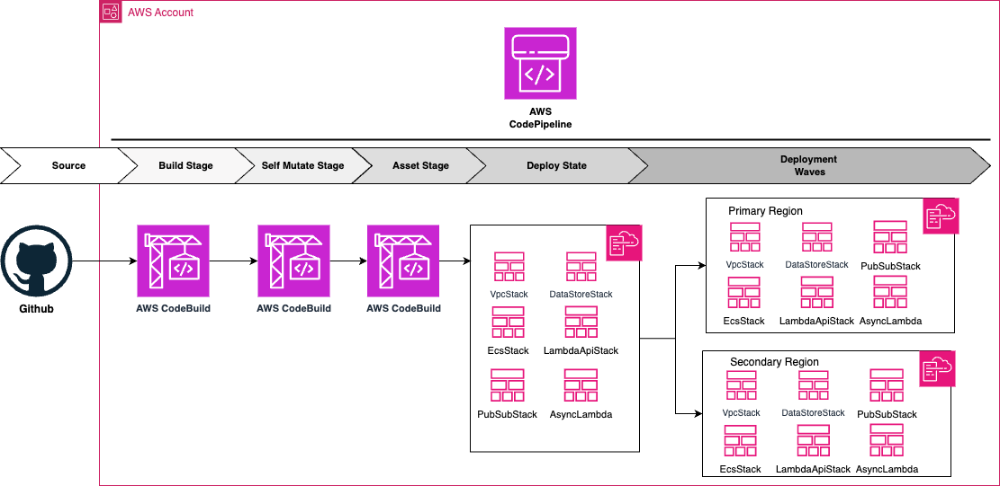

# AWS Codepipeline CI/CD Solution for ECS Fargate and Lambda

## Architect Design:

## Overview

This CDK package provides a production-grade template for setting up AWS resources to enable smooth migration from monolithic EC2-based architectures to cloud-native solutions on AWS. It's designed for startups looking to scale their infrastructure efficiently.

Key features:

- CICD pipeline using AWS CodePipeline
- Lambda functions (async triggered and REST endpoints behind API Gateway)
- ECS Fargate based service with automatic deployment
- Integration with private GitHub repositories
- Reference to CDK created VPCs
- Creates RDS Instances with credentials managed by AWS Secrets Manager
- Event-driven architecture using SQS, SNS, and EventBridge

## Getting Started

### Prerequisites

- Create a Private Github Repository with source code inside 'aws-codepipeline-ecs-lambda' directory.
- Create a connection to GitHub or GitHub Enterprise Cloud, see [Create a connection to GitHub](https://docs.aws.amazon.com/dtconsole/latest/userguide/connections-create-github.html).
- Modify the `connectionArn` in `pipeline-stack.ts` file.
- Modify `githubOrg`, `githubRepo`, `githubBranch` with your private repository details.

## Project Structure

The project is organized into six main stacks:

1. `VpcStack`: Network infrastructure resources
2. `DataStoresStack`: Database resources
3. `PubSubStack`: Event-based infrastructure (SQS, SNS, EventBridge)
4. `AsyncLambdasStack`: Asynchronously triggered Lambda functions
5. `LambdaApisStack`: Lambda functions as REST endpoints behind API Gateway
6. `EcsFargateStack`: ECS Fargate Service, Cluster, Tasks, and Containers

You can easily customize the infrastructure by modifying or removing specific stacks in the `lib/pipeline-stage.ts` file.

## Solution overview

The CDK application is structured as follows:

`lib/pipeline-stack.ts` contains the definition of the CI/CD pipeline. The main component here is the CodePipeline construct that creates the pipeline for us

`lib/stage-app.ts` contains definitions of all the six stacks which the pipeline will deploy.

`lib/stage-app-vpc-stack.ts` creates new vpc resource along with subnets, nat gateways and remaining networking infrastructure.

`lib/stage-app-datastore-stack.ts` creates a Aurora Serverless V2 Cluster along with KMS key to encrypt the database.

`lib/stage-app-ecs-fargate-stack.ts` builds the `Dockerfile` and creates ecs fargate service along with loadbalancer.

`lib/stage-app-lambda-api-stack.ts` creates lambda functions as REST endpoints behind API Gateway resource.

`lib/PubSubStack.ts` creates sns, eventbridge and lambda function.

---

## Application topology

There are two diagrams in this README and they show different things:

- **`## Architect Design:`** at the top (`static_images/Architecture_diagram.png`, from upstream) is
  the **pipeline** view — how a commit moves through the CodePipeline stages and out into the
  deployment waves. The stacks appear there only as unlabelled boxes.
- The one below is the **application** view — what a single deployed stage contains and how the
  services connect. The whole pipeline is collapsed into one block.

One block per stack in `lib/stage-app.ts`. Only the Fargate service and the Aurora cluster sit in
the VPC — the API Gateway and EventBridge Lambdas have no `VpcConfig`.

> Note: the upstream diagram and the `## Project Structure` list above are out of date. They name
> six stacks, including `DataStoresStack` and `PubSubStack`. `lib/stage-app.ts` creates five —
> `VpcStack`, `LambdaApisStack`, `EcsFargateStack`, `AsyncLambdasStack`, `rdsAuroraStack` — and
> synth produces exactly those five templates per stage.

## Why this example

- **One deployment model spread over many templates.** The five application stacks live in a
  `cdk.Stage`, so `cdk.out` holds nested cloud assemblies (`assembly-aws-codepipeline-stack-*`)
  instead of a single template. 19 templates, 356 resources, 17 AWS services.
- **Cross-stack relations.** `VpcStack` publishes 7 CloudFormation `Export`s; `EcsFargateStack`
  consumes 7 `Fn::ImportValue`s and `rdsAuroraStack` 4. The VPC-to-compute relation only exists
  across a stack boundary, and the ordering is in `manifest.json`, not in the templates.
- **The same topology three times.** The stage is instantiated once for `dev` and twice more in a
  wave (`us-west-2`, `eu-west-1`), so identical components repeat under different logical IDs.

## Transformation input

- `cdk.out/` — the synthesized CloudFormation output (`manifest.json`, `tree.json`, and the
  per-stack templates under `cdk.out/` and `cdk.out/assembly-*/`) used as the transformation input.

`cdk.context.json` pins the availability zones for the placeholder accounts so `cdk synth` runs
without AWS credentials. Building the ECS container image needs Docker running.
