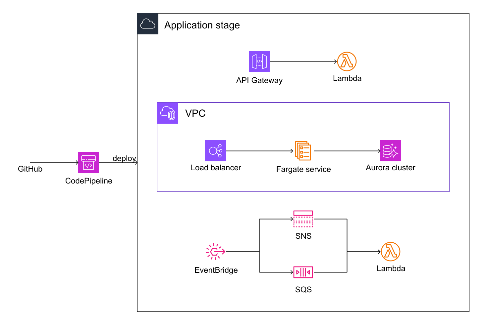

# CodePipeline ECS + Lambda

A CI/CD solution built with AWS CodePipeline that deploys a multi-stack application: a VPC, an
Aurora datastore, an ECS Fargate service behind an Application Load Balancer, REST Lambda functions
behind API Gateway, and an asynchronous EventBridge / SNS / SQS tier. Because the pipeline supports
cross-region deployment, the synthesis produces several stacks.

## Architecture

## Transformation input

The `cdk.out/` directory is the input to the CDK → EDMM transformation. The cdk-plugin parser only
reads:

- `manifest.json` — the list of stacks,
- `tree.json` — the CDK construct hierarchy,
- the `*.template.json` files — the synthesized CloudFormation resources for each stack
  (`aws-codepipeline-stack` plus the `cross-region-stack-*` support stacks).

## Origin

Adapted from [`typescript/aws-codepipeline-ecs-lambda`](https://github.com/aws-samples/aws-cdk-examples/tree/main/typescript/aws-codepipeline-ecs-lambda)
in the official [aws-samples/aws-cdk-examples](https://github.com/aws-samples/aws-cdk-examples) repository.
