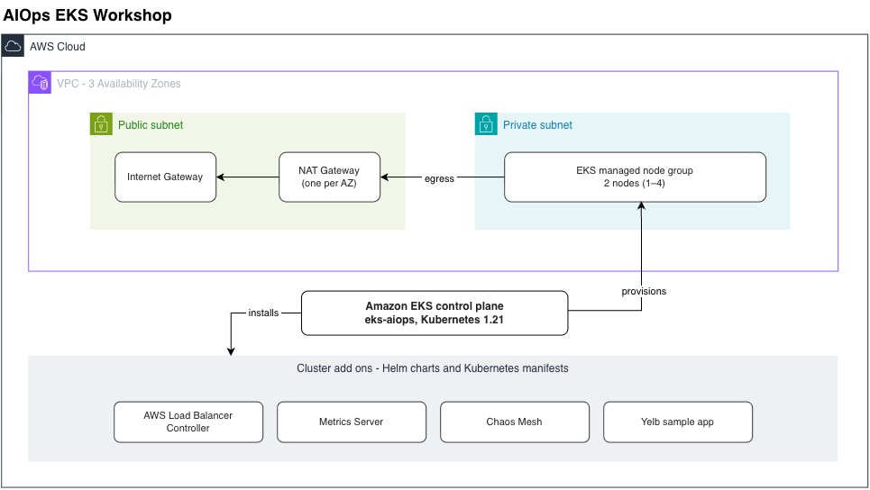

# AIOps EKS Workshop

An Amazon EKS (managed Kubernetes) cluster built with the
[EKS Blueprints](https://aws-quickstart.github.io/cdk-eks-blueprints/) framework, provisioned in a
dedicated VPC with a managed node group. On top of the cluster it installs several add-ons:
Container Insights, the AWS Load Balancer Controller, Metrics Server, Chaos Mesh (via Helm), and
the Yelb sample application (via Kubernetes manifests).

## Architecture

## Transformation input

The `cdk.out/` directory is the input to the CDK → EDMM transformation. The cdk-plugin parser only
reads:

- `manifest.json` — the list of stacks,
- `tree.json` — the CDK construct hierarchy,
- `eks-aiops.template.json` — the synthesized CloudFormation resources.

## Origin

Adapted from [`typescript/aiops-eks-workshop`](https://github.com/aws-samples/aws-cdk-examples/tree/main/typescript/aiops-eks-workshop)
in the official [aws-samples/aws-cdk-examples](https://github.com/aws-samples/aws-cdk-examples) repository.
